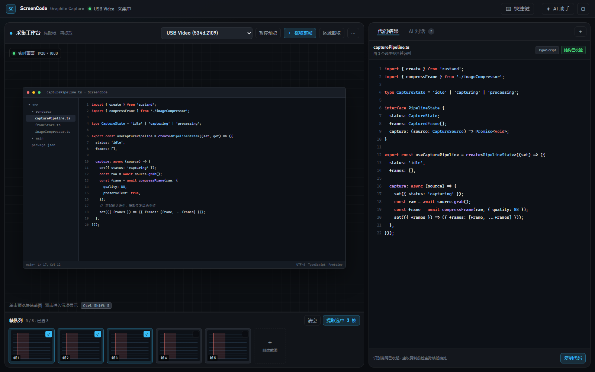
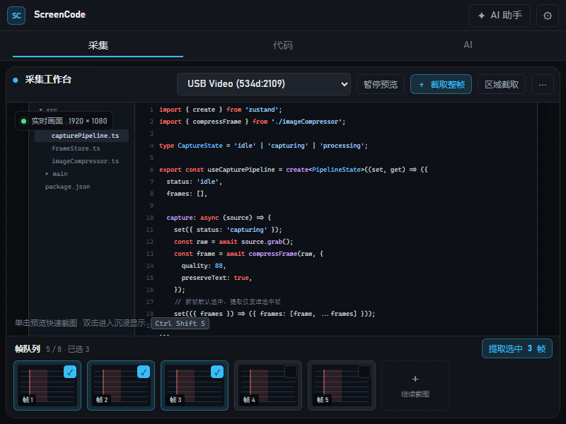
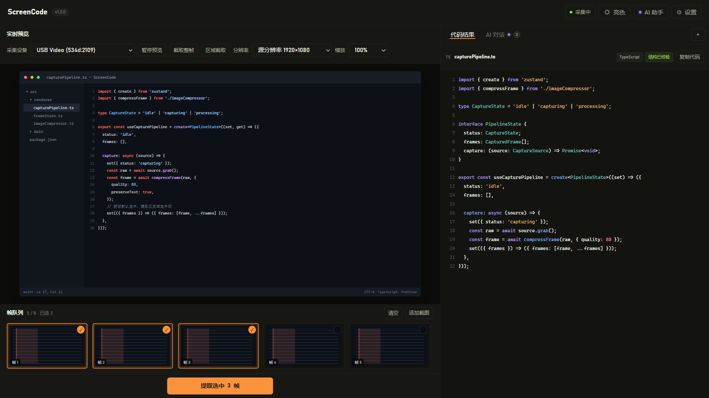
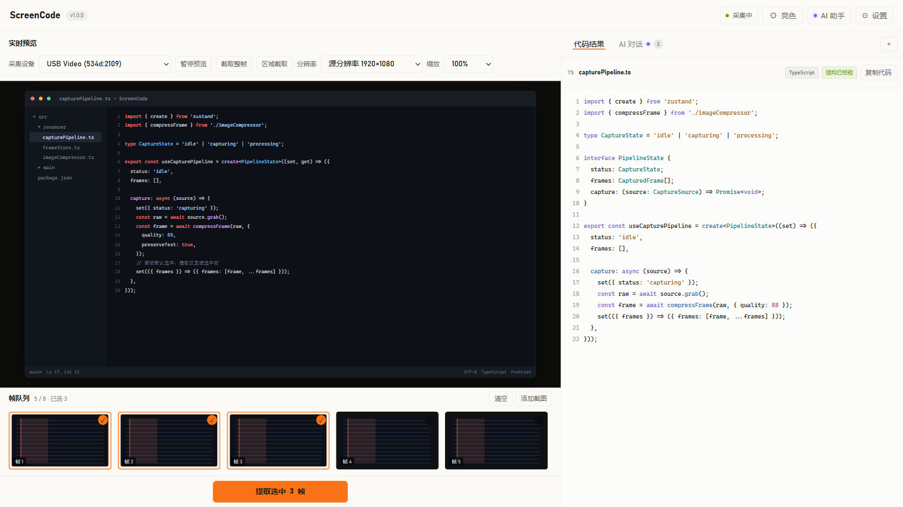

# ScreenCode Neo Utility 双主题视觉设计系统

> 状态：**双主题仿真已完成，真实项目待实现**　｜　目标分支：`refactor/arch-visual`　｜　编写日期：2026-07-29
>
> 本文既是本次改造的执行方案，也是改造完成后的设计系统规范。
> 执行时对照第 5、6 章逐项落地；日后新增界面对照第 3、4 章取值。
>
> 交互原型：[Neo Utility 双主题仿真页](graphite-capture-prototype.html)。原型采用宽屏双栏、
> 800×600 标签式紧凑布局，并将状态 / 元信息 / 提示拆分为三类；最终实现以原型确认结论为准。

---

## 0. 原型设计稿

### 0.1 历史宽屏基线（1600×1000）



### 0.2 历史紧凑基线（800×600）



### 0.3 Neo Utility 暗色主题（已确认，2026-08-03）



暗色稿由可运行仿真页在 1672×941 视口直接输出，采用暖灰近黑表面、信号琥珀橙主操作和
柔紫 AI 状态。它与亮色稿共用布局、组件与状态模型，不维护独立页面分支。

### 0.4 Neo Utility 亮色主题（已确认，2026-08-03）



亮色稿同样由仿真页直接输出，采用暖纸白与雾灰表面、墨色正文。界面不常驻展示产品说明、
操作教学或重复快捷键；仅保留区域名称、控件标签、实时状态和当前任务所需操作。

### 0.5 双主题交互约束

- 首次打开且用户未选择主题时，读取 `prefers-color-scheme`。
- 用户手动切换后写入 `localStorage`，后续打开优先恢复该选择。
- 切换只替换语义 Token，不改变 DOM、布局、帧选择、代码结果或 AI 会话状态。
- 信号琥珀橙仅用于主操作和选中态；柔紫仅用于 AI 状态；采集状态使用独立成功色。
- 所有颜色与背景过渡受 `prefers-reduced-motion` 约束。

> 修订记录（2026-08-03）：强调色由酸性青柠 `#b9f227` 改为信号琥珀橙（见 3.3）；
> 0.3 / 0.4 仿真稿已按新色重新输出（v2，琥珀橙），v1 青柠版保留在 assets 目录作历史对照。
## 1. 目标与范围

### 1.1 要解决的问题

代码审核发现界面存在 8 类视觉问题，按影响排序：

| # | 问题 | 证据 |
|---|------|------|
| 1 | 毛玻璃是无效投入 | 12 个 `glass-*` 类使用 `backdrop-filter`，但窗口不透明，滤镜背后只有应用自身背景 |
| 2 | 整屏只有一个明度层级 | `--bg #07111f`、`glass-subtle rgba(15,27,45,.72)`、`glass-medium rgba(19,34,57,.84)` 在深色下几乎不可分 |
| 3 | 引导文案常驻挤占版面 | `panel-subheading` 出现 9 处，永久占用约 20% 垂直空间 |
| 4 | 状态与提示视觉等权重 | `status-chip` 出现 20 处，其中约半数承载的是操作说明而非状态 |
| 5 | 主按钮定位越界 | `App.tsx` 中 `absolute top-4 right-4` 压住 Preview 面板 header |
| 6 | 垂直空间失衡 | 帧队列固定 128px 内塞四层内容，缩略图实际仅剩约 40px 高 |
| 7 | 圆角体系未落地 | 实际混用 `rounded`/`rounded-sm`/`rounded-lg`/`rounded-xl`/`rounded-full` 共 6 种，另有 2 处 inline `borderRadius` |
| 8 | 无图标语言 | 全部按钮纯文字，密集排布时是一排等宽灰块 |

### 1.2 范围

**在范围内**：design token 体系、组件类、9 个组件文件的样式迁移、主工作区垂直比例、图标引入。

**本轮不在范围内**：真实 Electron 组件改造、业务逻辑改动和发布配置。亮暗主题的真实项目实现
已确认为后续任务；仿真页先验证语义 Token、主题持久化与响应式布局。

---

## 2. 方向决策：放弃 glassmorphism

### 2.1 结论

改为 **Neo Utility 中性实色分层 + 信号琥珀橙主操作 + 柔紫 AI 状态**。

### 2.2 依据

**毛玻璃在本项目不成立。** `backdrop-filter` 的视觉价值来自"透过半透明表面看到下层内容的虚化"。
本应用的 `BrowserWindow` 未设置 `transparent` 或 `vibrancy`，窗口不透明，因此每个面板的滤镜
背后只有 `body` 那层深色渐变——模糊一层纯色渐变，结果与直接刷半透明色块几乎无差别。

git 历史印证了这一点：`923c679` 全局改造为毛玻璃、`59771c2` "毛玻璃效果真正生效 —— 丰富背景
光晕 + saturate + 内高光"，两轮加码仍未达预期。继续在此方向投入不会有回报。

**代价是实际存在的。** 每个 `backdrop-filter` 元素会被提升为独立合成层。当前 9 个 `glass-subtle`
+ 6 个 `glass-medium` + 6 个 `glass-strong` + 4 个 `glass-heavy` 意味着主界面常驻约 25 个合成层，
在拖拽聊天面板、滚动帧队列时会产生可感知的卡顿。

**工具型界面的诉求是扫读效率。** 代码内容是界面主角，去饱和的中性背景最不抢戏；
现有深蓝底色（`#07111f`，蓝色分量明显）会与代码高亮的蓝/青色系竞争。

### 2.3 唯一保留 backdrop-filter 的位置

Settings 模态的全屏遮罩——那里背后确实是主界面内容，虚化有真实意义。

---

## 3. Design Token

仿真页 Token 定义在 `graphite-capture-prototype.html`；后续真实项目将同名 Token 迁入 `src/renderer/styles/globals.css`，组件不得直接写主题色值。

### 3.1 表面层级

| Token | 亮色 | 暗色 | 用途 |
|-------|------|------|------|
| `--surface-0` | `#f5f4ef` | `#10110e` | 应用底层 |
| `--surface-1` | `#fbfaf7` | `#171814` | 顶栏、主面板 |
| `--surface-2` | `#f0f0ea` | `#20211c` | 输入框、次级控件 |
| `--surface-3` | `#e6e6de` | `#292b24` | hover、kbd、浮层 |
| `--surface-code` | `#fcfcfa` | `#131410` | 代码结果编辑器 |

主工作区各功能区使用 `.panel`（`--r-lg` 圆角 + 1px 边框）表达层级，不依赖阴影；面板内部的
分区只用 1px 分隔线，不再嵌套卡片。预览内容始终保留深色采集源表面，避免应用主题改变被
采集画面的含义。

### 3.2 文字与结构

| Token | 亮色 | 暗色 |
|-------|------|------|
| `--text` | `#171714` | `#f1f2ea` |
| `--text-muted` | `#66665f` | `#a6a89f` |
| `--text-dim` | `#8a8982` | `#73766d` |
| `--border` | `rgba(23,23,20,.10)` | `rgba(241,242,234,.085)` |
| `--border-strong` | `rgba(23,23,20,.18)` | `rgba(241,242,234,.16)` |

`--text-dim` 只允许用于禁用态、占位符、静态元信息（见 4.4 `.meta`）和非关键装饰信息；
真实状态、计数和可操作标签至少使用 `--text-muted`。两套主题的正文和交互标签均以
WCAG AA 为最低验收标准。

### 3.3 强调色与语义色

```css
/* 格式：亮色 → 暗色；未标注 → 表示两主题同值 */
--accent:        #f97316 → #fb923c;                /* 主操作填充、帧选中、圆点指示 */
--accent-ink:    #171714;                          /* accent 填充之上的文字（6.3:1） */
--accent-text:   #c2410c → #fdba74;                /* 强调文字/图标（AA 合规） */
--accent-subtle: rgba(249,115,22,.10) → rgba(249,115,22,.16);  /* 强调底色 */
--accent-border: rgba(194,65,12,.35) → rgba(249,115,22,.40);   /* 强调边框 */
--ai: #7c5cfc;     /* 亮色；暗色提升为 #9b87ff */
--success: #65a30d;/* 亮色；暗色提升为 #9ad84a */
```

信号琥珀橙只表达当前选择和主流程动作，不能用于普通装饰或所有按钮。**`--accent` 禁止直接
用作文字/图标色**；强调文字、`.chip-active`、当前标签一律使用 `--accent-text`
（亮色 `#c2410c` 在 `--surface-1` 上约 4.7:1，达 AA），`--accent` 本身仅用于
填充、圆点、下划线等图形元素。柔紫只表达 AI 在线状态、AI 标签和对话附件；采集状态、
校验成功、警告与错误使用各自语义色。

### 3.4 主题切换契约

根节点仅允许 `data-theme="light"` 或 `data-theme="dark"`。组件只消费语义变量；主题切换不得
重建组件、重置业务状态或引起布局位移。真实项目后续需要把主题状态提升到全局 Provider，
同步 Electron 系统主题，并将手动选择持久化；仿真页使用相同决策顺序验证该契约。
### 3.5 圆角

```css
--r-sm:  6px;  /* 按钮、输入框、chip、kbd */
--r-md: 10px;  /* 卡片、缩略图、消息气泡 */
--r-lg: 14px;  /* 面板、模态框、浮层 */
```

**只允许这三档 + `rounded-full`（仅用于圆点指示器）。**
现有 6 种混用需全部收敛，2 处 inline `borderRadius` 必须清除。

### 3.6 阴影

```css
--shadow-sm: 0 1px  2px rgba(0, 0, 0, 0.30);
--shadow-md: 0 4px 12px rgba(0, 0, 0, 0.35);
--shadow-lg: 0 12px 32px rgba(0, 0, 0, 0.45);
```

**实色分层后，面板本身不投影**——层级由 surface + border 表达。
阴影仅用于真正浮起的元素：下拉菜单、模态框、Toast。
现有 `shadow-glass`(2)、`shadow-glass-lg`(3)、`shadow-glass-glow`(4) 共 9 处，
其中面板上的一律删除。

### 3.7 间距

不新增变量。**约束为只使用 Tailwind 的 `1/2/3/4/6`**（4/8/12/16/24px）五档。
面板内边距统一 `p-3`(12px)，面板间距 `gap-3`(12px)，
分组间距 `gap-2`(8px)，紧凑元素 `gap-1`(4px)。

---

## 4. 组件类规范

以下类定义在 `@layer components`，**完全替换** 12 个 `glass-*` 类。

### 4.1 容器

```css
.panel {
  background: var(--surface-1);
  border: 1px solid var(--border);
  border-radius: var(--r-lg);
}

.panel-header {
  display: flex;
  align-items: center;
  justify-content: space-between;
  gap: 0.75rem;
  min-height: 40px;
  padding: 0 0.75rem;
  border-bottom: 1px solid var(--border);
}

.panel-title {
  font-size: 0.875rem;
  font-weight: 600;
  color: var(--text);
}

.card {
  background: var(--surface-2);
  border: 1px solid var(--border);
  border-radius: var(--r-md);
}

.overlay {
  background: var(--surface-2);
  border: 1px solid var(--border-strong);
  border-radius: var(--r-lg);
  box-shadow: var(--shadow-lg);
}
```

| 类 | 用于 | 不要用于 |
|----|------|---------|
| `.panel` | 三个主功能区、聊天面板 | 面板内的任何元素 |
| `.card` | 缩略图卡片、供应商卡片、说明块 | 顶层容器 |
| `.overlay` | 会话下拉、Settings 模态、Toast | 常驻元素 |

### 4.2 按钮

```css
.btn {
  display: inline-flex;
  align-items: center;
  gap: 0.375rem;
  border: 1px solid var(--border);
  border-radius: var(--r-sm);
  background: transparent;
  color: var(--text-muted);
  transition: background 150ms ease, border-color 150ms ease, color 150ms ease;
}
.btn:hover:not(:disabled) {
  background: var(--surface-3);
  border-color: var(--border-strong);
  color: var(--text);
}
.btn:active:not(:disabled) { background: var(--surface-2); }
.btn:disabled { opacity: 0.4; cursor: not-allowed; }

.btn-primary {
  /* 继承 .btn 结构，覆盖配色 */
  background: var(--accent-subtle);
  border-color: var(--accent-border);
  color: var(--accent-text);
}
.btn-primary:hover:not(:disabled) {
  background: var(--accent);
  border-color: var(--accent);
  color: var(--accent-ink);
}

/* .btn-danger / .btn-success 同构，分别替换为 --danger / --success */
```

**实现约定**：基础结构与变体使用合并选择器（`.btn, .btn-primary, .btn-danger, .btn-success { }`），
变体类可单独使用，**无需与 `.btn` 叠写**；变体规则定义在基础规则之后，同优先级下覆盖配色。
（2026-08-03 迁移时曾出现变体类缺少基础结构导致图标/文字换行的缺陷，根源即在此。）

**去掉了 `transform: translateY(-1px)` 的 hover 位移**——工具型界面的密集按钮组里，
位移会造成视觉抖动。改为纯配色反馈。

### 4.3 输入

```css
.input {
  background: var(--surface-2);
  border: 1px solid var(--border);
  border-radius: var(--r-sm);
  color: var(--text);
  transition: border-color 150ms ease, box-shadow 150ms ease;
}
.input::placeholder { color: var(--text-dim); }
.input:focus {
  outline: none;
  border-color: var(--accent-border);
  box-shadow: 0 0 0 2px var(--accent-subtle);
}
```

### 4.4 状态、提示与元信息（关键区分）

这是解决问题 4 的核心——**状态、提示与元信息必须视觉可分**：

```css
/* 状态：有边框有底色，表达"当前是什么" */
.chip {
  display: inline-flex;
  align-items: center;
  gap: 0.375rem;
  padding: 0.125rem 0.5rem;
  font-size: 0.75rem;
  line-height: 1.5;
  border: 1px solid var(--border);
  border-radius: var(--r-sm);
  background: var(--surface-2);
  color: var(--text-muted);
}

/* 活跃状态：强调色 + 前置圆点 */
.chip-active {
  border-color: var(--accent-border);
  background: var(--accent-subtle);
  color: var(--accent-text);
}
.chip-active::before {
  content: '';
  width: 6px; height: 6px;
  border-radius: 9999px;
  background: currentColor;
}

/* 提示：无边框无底色，表达"你可以做什么" */
.hint {
  font-size: 0.75rem;
  line-height: 1.5;
  color: var(--text-muted);
}

/* 元信息：静态标注（时间、路径、版本等），视觉权重最低 */
.meta {
  font-size: 0.6875rem;
  line-height: 1.5;
  color: var(--text-dim);
}

.kbd {
  padding: 0.0625rem 0.3125rem;
  font-family: ui-monospace, 'SF Mono', Consolas, monospace;
  font-size: 0.6875rem;
  border: 1px solid var(--border);
  border-radius: 4px;
  background: var(--surface-3);
  color: var(--text-muted);
}
```

**判定规则**：内容会随应用状态改变 → `.chip`；固定的操作说明 → `.hint`；静态元信息
（时间戳、路径、版本等不参与操作决策的标注）→ `.meta`。
例：`未选择设备`→chip，`双击进入全屏`→hint。

### 4.5 消息气泡

```css
.msg-user {
  background: var(--accent-subtle);
  border: 1px solid var(--accent-border);
  border-radius: var(--r-md);
}
.msg-assistant {
  background: var(--surface-2);
  border: 1px solid var(--border);
  border-radius: var(--r-md);
}
```

---

## 5. 迁移映射表

### 5.1 自定义类（精确替换）

| 旧类 | 出现次数 | 新类 | 备注 |
|------|---------|------|------|
| `glass-subtle` | 9 | `.panel` | |
| `glass-medium` | 6 | `.panel` | 顶栏需额外 `border-x-0 border-t-0` |
| `glass-strong` | 6 | `.overlay` | |
| `glass-heavy` | 4 | `.overlay` | |
| `glass-btn` | 12 | `.btn` | |
| `glass-btn-primary` | 12 | `.btn-primary` | |
| `glass-btn-danger` | 7 | `.btn-danger` | |
| `glass-btn-success` | 7 | `.btn-success` | |
| `glass-input` | 13 | `.input` | |
| `glass-kbd` | 5 | `.kbd` | |
| `glass-msg-user` | 2 | `.msg-user` | |
| `glass-msg-assistant` | 3 | `.msg-assistant` | |
| `panel-heading` | 5 | `.panel-title` | |
| `panel-subheading` | 9 | **删除** | 见 6.1 逐处处理 |
| `status-chip` | 20 | `.chip` / `.hint` / `.meta` | **需逐处判定**，规则见 4.4 |
| `shadow-glass` | 2 | 删除 | 面板不投影 |
| `shadow-glass-lg` | 3 | `.overlay` 自带 | |
| `shadow-glass-glow` | 4 | 删除 | 选中态改用 `.chip-active` / border |

### 5.2 Tailwind 原子类

| 旧类 | 次数 | 新写法 |
|------|-----|-------|
| `text-slate-100` / `text-slate-200` | 3 / 11 | `text-[var(--text)]` |
| `text-slate-300` | 19 | `text-[var(--text-muted)]` |
| `text-slate-400` | 12 | **逐处判定**：信息性→muted，装饰性→dim |
| `text-slate-500` | 7 | `text-[var(--text-dim)]`（确认非信息性） |
| `text-gray-200` / `text-gray-300` | 1 / 4 | 统一到 `--text` / `--text-muted` |
| `text-primary-300` | 4 | `text-[var(--accent)]`（先确认符合三分法） |
| `bg-white/[0.03~0.10]` | 14 | `.card` 或 `bg-[var(--surface-2)]` |
| `bg-slate-950/10~78` | 8 | 面板内分区改 `bg-[var(--surface-1)]`；遮罩保留 |
| `border-white/[0.06~0.12]` | 19 | `border-[var(--border)]` |
| `border-white/10` | 3 | `border-[var(--border)]` |
| `rounded` / `rounded-sm` | 6 / 8 | `rounded-[var(--r-sm)]` |
| `rounded-lg` | 9 | `rounded-[var(--r-sm)]` 或 `--r-md`（按元素判定） |
| `rounded-xl` | 6 | `rounded-[var(--r-md)]` |
| `rounded-full` | 6 | 保留（仅圆点/徽标） |

> 已确认（2026-08-03，第 10 章问题 5）：把三档圆角与四个文字色注册进 `tailwind.config.js`
> 的 `theme.extend`，使其可写作 `rounded-sm`/`text-muted` 等短类名，避免满屏 `var(--...)` 影响可读性。

---

## 6. 逐文件改造清单

### 6.1 `styles/globals.css`（重写）

- 删除：12 个 `glass-*` 类、`@supports not (backdrop-filter)` 降级块、
  body 的双 `radial-gradient` 光晕
- 新增：第 3 章全部双主题 Token、第 4 章全部组件类，以及根节点 `data-theme` 选择器
- body 背景改为：`linear-gradient(180deg, rgba(255,255,255,.02), transparent 240px), var(--surface-0)`
  （仅保留一道极淡的顶部高光，暗示光源方向）
- 保留：滚动条样式（色值改 token）、`pre` 字体栈、`prefers-reduced-motion`、
  `focus-visible` 焦点环（色值改 `--accent`）
- 预计 323 行 → 约 260 行

### 6.2 `tailwind.config.js`

- `theme.extend.colors` 增加语义色映射到 CSS 变量
- `theme.extend.borderRadius` 注册 `sm/md/lg` 三档
- **删除** 4 个 `glass-*` boxShadow
- 保留 `toast` 动画与 keyframes

### 6.3 `components/Layout`

- header 高度 `h-14`(56px) → `h-12`(48px)
- **删除副标题**"采集画面、整理帧队列..."（问题 3）
- 删除顶栏常驻快捷键说明；快捷键仅保留实际绑定，并在设置或按需帮助中查看
- **新增「AI 对话」入口按钮**，与「设置」并列（承接问题 5，把 App.tsx 里的浮动按钮移到这里）

### 6.4 `components/Preview`

- 面板 header 压缩为**单行**：标题 + 设备下拉 + 主操作按钮
- 删除副标题"先选择采集设备，再通过整帧截图..."
- 采集状态收敛为顶栏单个状态；分辨率与缩放保留在工具栏
- 删除 `双击进入全屏`、`单击可快速截图` 等常驻教学文案，改由按钮 `title` 或按需帮助承载
- 预览区不显示产品说明或快捷键提示，画面本身成为视觉主体

### 6.5 `components/ThumbnailQueue`

- 容器高度 `h-32`(128px) → `h-40`(160px)（问题 6）
- 容器支持**整体折叠**（仅保留单行 header），800×600 窗口空间不足时作为兜底（第 10 章已确认）；
  **视口高度 < 680px 时默认折叠**（`matchMedia('(max-height: 679px)')`，监听变化自动切换）
- header 单行化，删除副标题
- 缩略图卡片 `w-32` → `w-36`，底部操作条 34px 保留
- 选中态：`ring-2 ring-primary-500/20 shadow-glass-glow` → `border-[var(--accent-border)]` + `.chip-active` 角标

### 6.6 `components/CodeDisplay`

- header 单行化，删除副标题
- 空态文案由三句精简为一句 + 主操作按钮
- 语言/置信度 `.chip` 保留（真状态），置信度按阈值上语义色

### 6.7 `components/ChatPanel`

- header 删除副标题"围绕截图做 OCR、补全和解释..."
- 会话下拉 `glass-heavy` → `.overlay`
- 输入区底部提示改 `.hint`
- 帧队列缩略图选择区：hover 环 `ring-primary-500/40` → `border-[var(--accent)]`

### 6.8 `components/Settings`

- **清除两处 inline `style={{borderRadius}}`**
- 供应商网格 `grid-cols-1 md:grid-cols-2` → `repeat(auto-fill, minmax(240px, 1fr))`
  （解决 5 个供应商时最后一个孤立占半行）
- 表单 label `text-xs` → `text-sm`，颜色 `--text-muted`
- 选中态 `bg-primary-600/20 border-primary-500/40 shadow-glass-glow` → `.card` + `--accent-border` + 左侧 3px 强调条
- 遮罩保留 `backdrop-blur`

### 6.9 `components/Toast`

- `glass-heavy` → `.overlay`
- 语义色改为**左侧 3px 边框** + 中性底，替代现在的整块染色

### 6.10 `App.tsx`

- **删除** `absolute top-4 right-4` 的"打开 AI 对话"按钮（入口移入 Layout header）
- 垂直比例：预览区优先，帧队列保留可辨识缩略图，代码结果占右侧完整高度
- `min-h` 相应调整：预览 `min-h-[220px]`、代码 `min-h-[180px]`

### 6.11 真实项目主题基础设施（后续任务）

- 新增全局 `ThemeProvider`，只暴露 `light` / `dark` / `setTheme`，组件不得自行读取存储
- 首次启动读取 Electron 系统主题；手动选择写入持久化配置并覆盖系统值
- 在 `document.documentElement` 统一设置 `data-theme`，所有组件只消费第 3 章语义 Token
- 监听系统主题变化仅在用户未手动选择时生效，避免覆盖用户明确偏好
- 主题切换不得重建采集流、清空帧队列、重置代码结果或中断 AI 会话

---

## 7. 图标规范

引入 `lucide-react`（ESM，按需导入，单图标 tree-shake 后约 1KB）。
**执行第一步：`npm install lucide-react`**（当前 `package.json` 尚无此依赖），
构建后对比产物体积，增量超 20KB 时按本节末尾预案回退。

| 位置 | 图标 | 形式 |
|------|------|------|
| 截取整帧 | `Camera` | 图标 + 文字 |
| 区域截取 | `Crop` | 图标 + 文字 |
| 全屏 / 退出 | `Maximize2` / `Minimize2` | 纯图标 + title |
| 删除帧 | `Trash2` | 纯图标 + title |
| 查看帧 | `Eye` | 纯图标 + title |
| 复制代码 | `Copy` / `Check` | 图标 + 文字 |
| 发送 | `Send` | 图标 + 文字 |
| 设置 | `Settings` | 纯图标 + title |
| AI 对话 | `MessageSquare` | 图标 + 文字 |
| 新建会话 | `Plus` | 纯图标 + title |
| 收起面板 | `PanelRightClose` | 纯图标 + title |

规则：**主操作用「图标 + 文字」，次要/重复操作用「纯图标 + title」**。
图标尺寸统一 14px（`size={14}`），与 12px 文字基线对齐。

若构建后产物体积增量超过 20KB，改为手写 inline SVG（当前已有 2 个手写 SVG 空态图标可复用该模式）。

---

## 8. 验收标准

### 8.1 自动检查

```bash
npm run typecheck && npm run lint
```

全局 grep 断言为零：

```bash
grep -rn "glass-" src/renderer/          # 应为 0
grep -rn "backdrop-filter" src/renderer/ # 仅 Settings 遮罩 1 处
grep -rn "borderRadius" src/renderer/    # 应为 0（inline style）
grep -rn "shadow-glass" src/renderer/    # 应为 0
```

### 8.2 目视检查

在 800×600（默认窗口）、1280×800、1920×1080 三档下：

- 无横向滚动条，无内容溢出
- 三个功能区边界清晰可辨（层级验证）
- 状态 chip 与提示文字视觉可分（问题 4 验证）
- 顶栏「AI 对话」与主题切换按钮不与任何内容重叠（问题 5 验证）
- 帧队列缩略图高度足够看清画面内容（问题 6 验证）
- 亮色 / 暗色切换无需刷新，切换前后的帧选择、代码结果和 AI 会话不变
- 手动主题选择在重新打开页面后恢复；未选择时跟随系统主题
- 首屏不存在产品说明、操作教学或重复快捷键等常驻描述文案

### 8.3 对比度抽查

按 3.3 / 3.4 节标注值抽查：主文本、次要文本、强调色、禁用态各一处。

---

## 9. 风险与应对

| 风险 | 影响 | 应对 |
|------|------|------|
| className 大范围替换漏改 | 类被删后元素无样式，视觉塌陷 | 8.1 的 grep 断言 + 三档窗口目视检查 |
| `--text-dim` 误用导致可读性下降 | 信息文字对比度跌到 3.7:1 | 5.2 表中 `text-slate-400/500` 共 19 处标记为「逐处判定」，不做批量替换 |
| lucide-react 未有效 tree-shake | 产物体积膨胀 | 构建后对比体积，超 20KB 回退手写 SVG |
| 垂直比例调整在 800×600 下挤压 | 内容溢出 | 三段最小高度合计需 ≤ 主区可用高度；必要时帧队列降级为单行或可折叠 |
| 层级对比度偏低（1.09） | 面板边界不清 | 边框为强制项（3.2）；若实测仍不足，surface-0 下调至 `#07090c` |

### 回滚

改动集中在样式层，无业务逻辑变更。
单 commit 提交，回滚执行 `git revert` 即可，不影响第一、二批的功能修复。

---

## 10. 待确认问题

执行前需要确认：

1. ~~**表面层级取值**（3.1）：1.09~1.17 的相邻对比度是否足够？~~
   **已确认（2026-08-03）**：维持现值，1px 边框为强制项；仿真稿目视已验证层级可辨，
   不再下调 surface-0。实测不足时按第 9 章预案处理。
2. ~~**状态/提示二分**（4.4）是否足够，还是需要三分（状态 / 提示 / 元信息）？~~
   **已确认（2026-08-03）**：采用三分，4.4 已补 `.meta` 类与判定规则。
3. ~~**垂直比例** `flex-[2] / 160px / flex-[1.4]` 在 800×600 默认窗口下是否可行？~~
   **已确认（2026-08-03）**：按此比例执行，帧队列同时实现为可折叠（6.5 已补充），
   800×600 下空间不足时折叠兜底。
4. ~~**图标库**：引入 lucide-react，还是沿用手写 inline SVG？~~
   **已确认（2026-08-03）**：引入 lucide-react，构建体积增量超 20KB 回退手写 SVG（第 7 章）。
5. ~~**Tailwind 短类名注册**（5.2 末尾建议）：是否值得为可读性做这层映射？~~
   **已确认（2026-08-03）**：注册，6.2 列为必做项。
